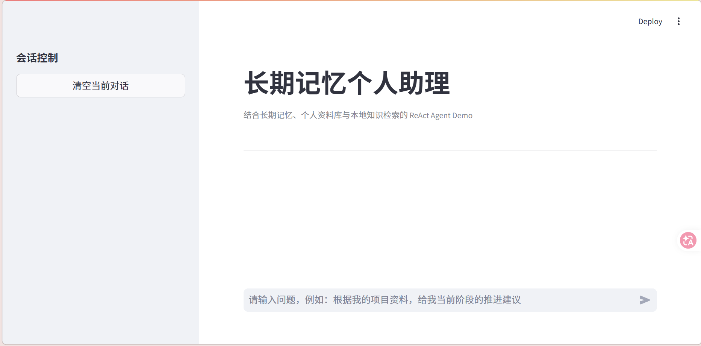
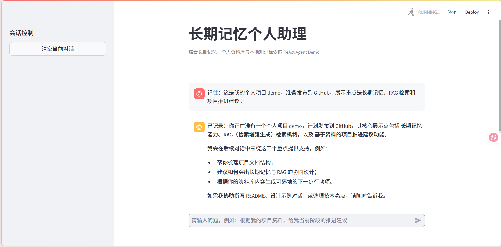
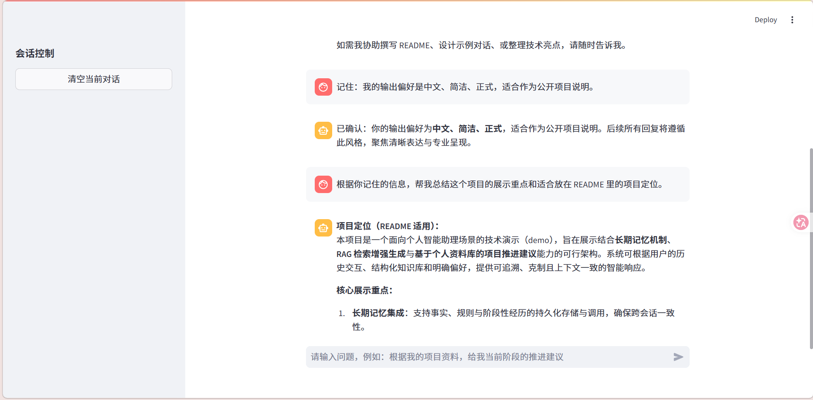
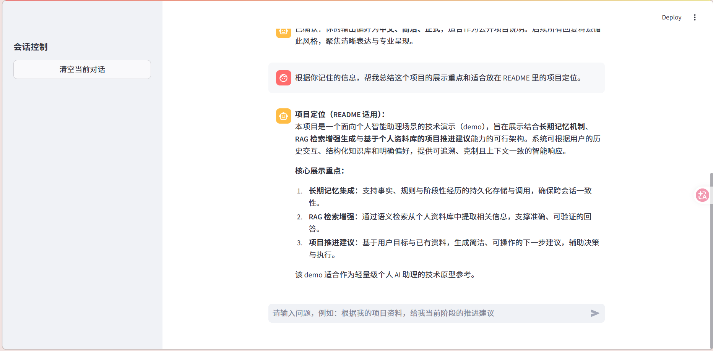
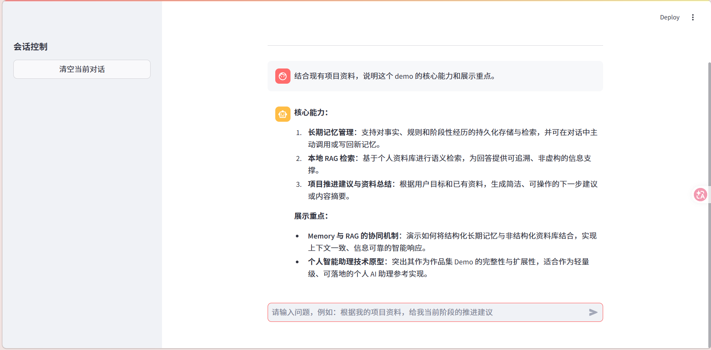

# LangChain ReAct Agent with Long-Term Memory

一个面向个人知识管理与持续对话场景的 Agent Demo。项目基于 LangChain、Chroma 和 Streamlit 构建，支持本地知识库检索、长期记忆沉淀、会话上下文管理，以及基于个人资料的问答与建议生成。

## ✨ 项目亮点

- 支持长期记忆、知识库检索与对话生成的组合式工作流
- 内置事实记忆、规则记忆、阶段性经历记忆与工作记忆
- 支持本地资料自动入库与向量检索
- 提供可直接运行的 Streamlit 界面，适合作为个人项目 Demo 展示
- 所有运行数据本地持久化，方便持续迭代和扩展

## 🎯 适用场景

- 个人知识库问答与总结
- 项目资料沉淀与长期对话记忆
- 个人智能助理原型验证
- Memory + RAG 方向的作品集展示

## 🎬 UI 演示视频

- [查看完整演示视频](assets/personal-ai-agent-demo.mp4)

[](assets/personal-ai-agent-demo.mp4)

## 🖼️ 效果展示

### 首页对话界面


### 记忆增强问答效果





### 知识库检索与回答结果



## 🧠 核心能力

### 1. 长期记忆管理

项目内置四类记忆能力：

- 工作记忆：维护当前会话中的最近上下文
- 事实记忆：沉淀长期稳定的信息，如项目背景、个人资料、领域事实
- 规则记忆：保存偏好、写作规则、工程原则和决策习惯
- 阶段记忆：记录阶段性事件、讨论结果与里程碑总结

### 2. 本地知识库检索

资料放入 `data/` 目录后，系统会自动读取并建立向量索引，用于补充回答依据，减少无根据生成。

### 3. 对话式个人助理

系统会结合当前问题、长期记忆与资料库内容生成回答，适合做个人项目说明、资料总结和阶段建议输出。

### 4. 轻量 Web 展示入口

基于 Streamlit 提供简洁的本地交互界面，方便调试、演示与截图展示。

## 🏗️ 项目结构

```text
.
├── agent/                   # 助理主流程与工具定义
├── assets/                  # README 展示图片
├── config/                  # YAML 配置文件
├── data/                    # 本地知识库目录
├── memory/                  # 长期记忆模块
├── model/                   # 模型初始化
├── prompts/                 # 系统提示词与检索提示词
├── rag/                     # 向量检索与总结服务
├── runtime/                 # 运行期数据目录
├── utils/                   # 通用工具
├── app.py                   # Streamlit 入口
└── requirements.txt
```

## ⚙️ 技术栈

- Python 3.10+
- LangChain
- LangChain Community
- Chroma
- Streamlit
- DashScope
- SQLite

## 🔄 工作流程

1. 用户在界面输入问题
2. 系统加载当前会话上下文与长期记忆
3. 系统从本地资料库检索相关内容
4. 模型结合记忆与检索结果生成回答
5. 回答完成后，系统尝试抽取有长期价值的信息并写回记忆

## 🚀 快速开始

### 1. 安装依赖

```bash
pip install -r requirements.txt
```

### 2. 配置环境变量

本项目默认使用 DashScope 模型服务。

Windows PowerShell:

```powershell
$env:DASHSCOPE_API_KEY="your_api_key"
```

macOS / Linux:

```bash
export DASHSCOPE_API_KEY="your_api_key"
```

### 3. 准备知识库资料

将个人资料、项目资料或领域资料放入 `data/` 目录。推荐按主题分类存放：

- `data/profile/`
- `data/projects/`
- `data/preferences/`
- `data/decision_logic/`
- `data/work/`
- `data/learning/`

支持的文件格式：

- `.txt`
- `.md`
- `.pdf`

### 4. 启动应用

```bash
streamlit run app.py
```

首次启动时，系统会自动扫描 `data/` 目录并构建向量索引。后续重复启动时，会根据文件指纹跳过已入库内容。

## 📁 配置说明

### `config/rag.yml`

- `chat_model_name`：对话模型名称
- `embedding_model_name`：向量模型名称

### `config/chroma.yml`

- `collection_name`：向量集合名称
- `persist_directory`：Chroma 持久化目录
- `data_path`：知识库根目录
- `allow_knowledge_file_type`：允许入库的文件类型
- `chunk_size`：文本切分长度
- `chunk_overlap`：分片重叠长度

### `config/prompts.yml`

- `main_prompt_path`：主系统提示词
- `rag_summarize_prompt_path`：RAG 总结提示词

## 💾 运行数据

- 对话内容与长期记忆写入 `runtime/memory.db`
- 向量索引写入 `runtime/chroma_db/`
- 文件指纹记录写入 `runtime/md5.txt`

## 💡 演示建议

可以尝试以下问题：

- “根据我的项目资料，给我当前阶段的推进建议”
- “总结一下我在这个项目上的长期偏好和决策方式”
- “结合资料库，说明这个 Demo 的核心能力”
- “根据现有资料，帮我整理当前项目的下一步任务”

## 🛣️ 可扩展方向

- 接入更多模型提供商
- 增加更细粒度的记忆筛选与召回策略
- 增加多会话、多用户隔离能力
- 补充自动化测试与评估脚本
- 增加更完整的前端状态展示与调试能力

## 📮 联系方式

- Email: 15193540213@163.com

## 📄 License

This project is licensed under the MIT License.
